# 公众号天气&纪念日推送教程
## 1.微信开放平台注册

首先我们需要注册一个微信开放平台的测试号

http://mp.weixin.qq.com/debug/cgi-bin/sandboxinfo?action=showinfo&t=sandbox/index 

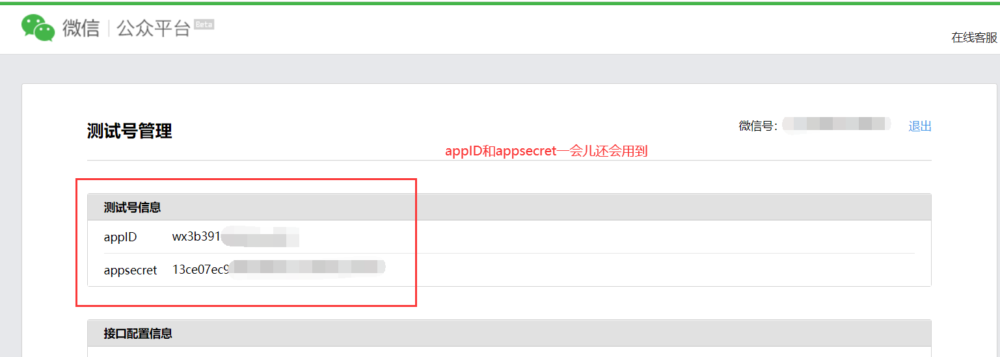

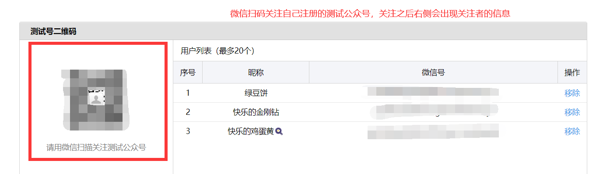

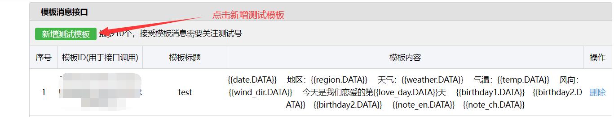

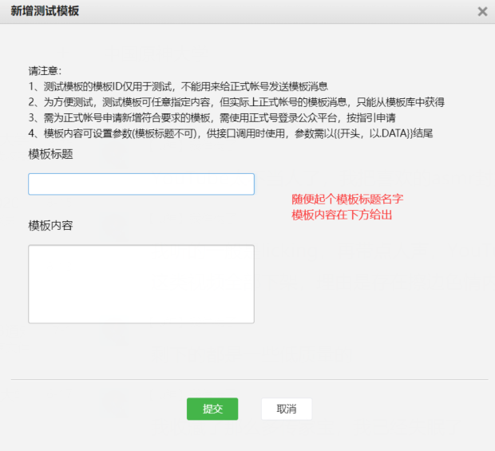

模板内容如下（模板内容能做修改，不过需要根据代码自己修改，不做过多赘述了）：

{{date.DATA}} 

地区：{{region.DATA}} 

天气：{{weather.DATA}} 

气温：{{temp.DATA}} 

风向：{{wind_dir.DATA}} 

今天是我们恋爱的第{{love_day.DATA}}天 

{{birthday1.DATA}} 
{{birthday2.DATA}}

## 2.和风天气API key获取

因为涉及到天气，我们需要搞个API来获取天气数据，注册一个和风天气

https://id.qweather.com/


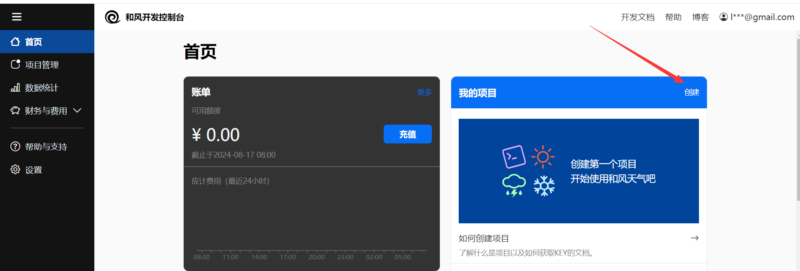

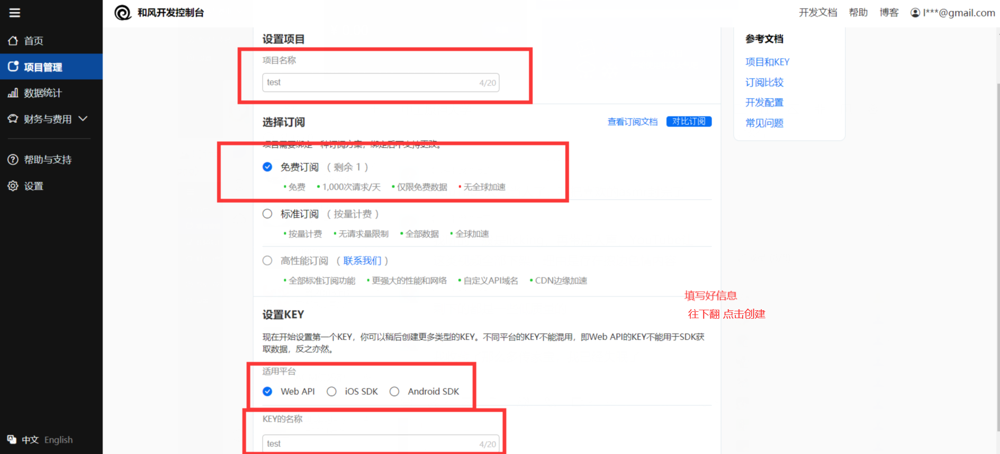

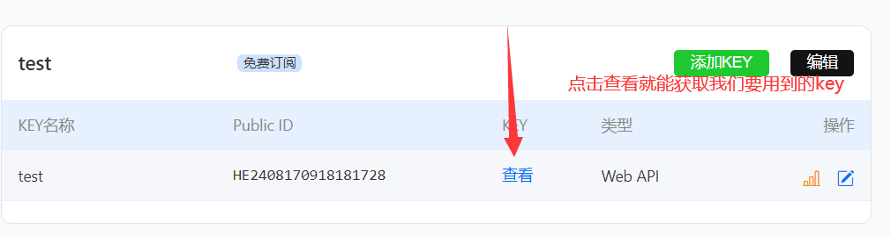

## 3.配置

找到代码中的config.txt文件


## 4.推送

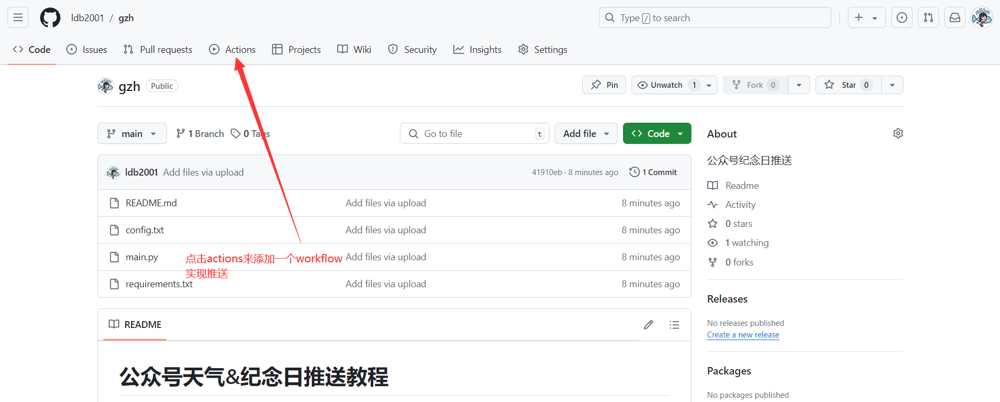

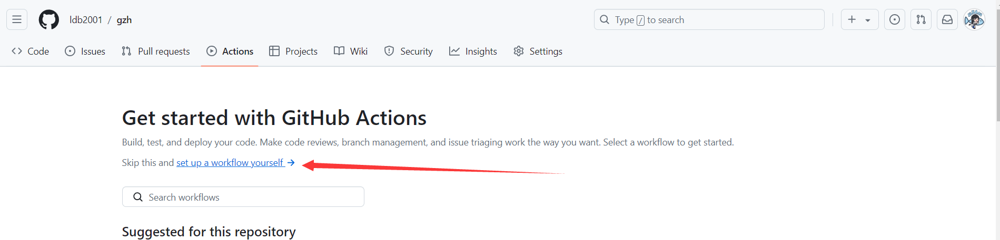

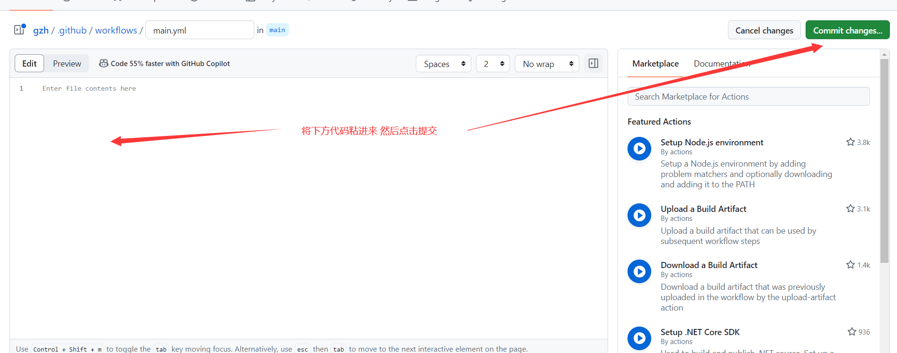

```
name: weixin
on:
  workflow_dispatch:
  schedule: 
    # 代表国际标准时间23点0分，北京时间需要+8小时，代表北京时间上午7点运行
    - cron: '0 23 * * *'
jobs:
#将工作流程中运行的所有作业组合在一起
  build:
  #定义名为 build 的作业。 子键将定义作业的属性 
    runs-on: ubuntu-latest 
    steps:
      - uses: actions/checkout@v2
    
      - name: Set up Python 3.12.5
        uses: actions/setup-python@v2
        with:
          python-version: 3.12.5
      - name: Set timezone
        run: |
          cp /usr/share/zoneinfo/Asia/Shanghai /etc/localtime
      - name: install pip packages
        run: |
          python -m pip install --upgrade pip
          pip3 install -r requirements.txt
      - name: weixin
        run: |
          python3 main.py
```

## 5.测试

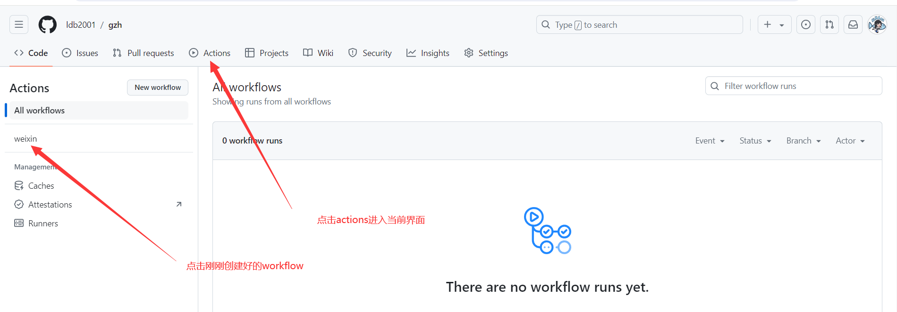

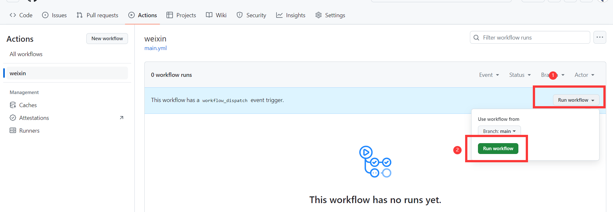

如果没什么问题的话config里填写的用户就会收到你的公众号推送啦

ps：自动推送在上面创建workflow时开头有一段填写时间的，有注释，很好理解，不过github推送可能不是那么准时，比如我设置的是早上7点，可能推送的时候已经7点多十几二十分钟了，甚至有时候会直接不推送哈哈哈，不是很稳定~🤣

## 有什么问题可以再找我哟🤣
